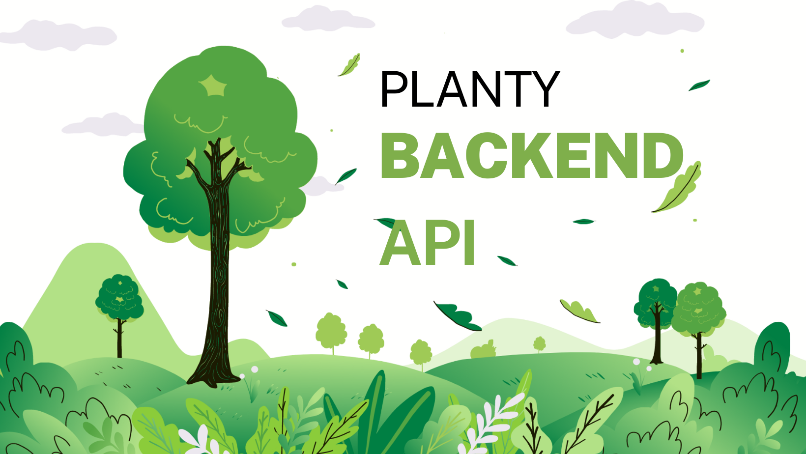

# Planty_Backend
<p align="center">
  
</p>
<p>

</p>

## Table of contents
**[Description](#desc)**<br>
**[Authors](#author)**<br>
**[Usage](#usage)**<br>
**[Tech and Modules used](#tech)**<br>
**[Route explanation](#explain)**<br>
**[API Routes](#route)**<br>

<a name="desc"></a>

## ⛓️ Description 
Rest-API for WebApp.This WebApp is an online IDLE Game, based in Liège.
The purpose is to collect trees existing in the city and become the biggest owner on the map by buying and locking every trees available.
The player receives a wallet with leafs(the game money) at the beginning and this wallet decreases and increase throughout the game. More explanation in the **[gamerules](#the-gamerules-for-planty)** .  

<a name="author"></a>

## 👩‍💻 Authors 
This api has been made by : 
<p align="center">
    
    
</p>

- Danaé Grosjean | [LinkedIn](linkedin.com/in/danae-grosjean/) | [GitHub](https://github.com/Da-nae)
- Khadja Paux | [LinkedIn](https://www.linkedin.com/in/khadja-paux/) | [GitHub](https://github.com/krabandicoot)

<a name="usage"></a>

## ⏳ Usage
How to run the project : 
#### Install the required modules ✔️
As you are in ```/server```, in your terminal run : 


```npm i```
#### Create your .env ✔️
Open the ```.env.example``` in the ```/server```. Rename it ```.env```. 

```
FRONTEND_LOCAHOST=http://localhost:3000 //Insert the localhost or deploy URL for your website
DB_URL=mongodb+srv://<username>:<password>@<your-cluster-url>/test?retryWrites=true&w=majority //Create a server for the DB on MongoAtlas
NODE_TOKEN=yoursecretstring //Choose a string to decrypt the token
NODE_PORT=8080 //Choose the port you want to run your API on
```
#### Launch the server 
As you are in ```/server```, in your terminal run :


``` npm run start ```


You should received :


<p>
  
</p>

#### Create your tree DB
Open the folder ```/db```
Run the command in your terminal : 


``` node seeder.js ``` 


Wait for the datas to seed in your database. 


Run the command in your terminal : 


```node deleteData.js```


The command will delete every tree with a value less than 200 and erase every tree with a null value.

<a name="tech"></a>

## 🚧 Techs and NPM Modules 
#### Techs : 
<p align="center">
    
    
</p>

**→** Node.js


**→** MongoDB 

#### NPM Modules and framework :
- **bcrypt** (hash the password)
- **cors** (allows restricted source on the webpage)
- **dotenv** (read the .env)
- **jwt-decode** (json token)
- **jsonwebtoken** (json token)
- **mongoose** (connect to MongoDB)
- **morgan** (Error testing logs)
- **node-cron** (Programs specific action)
- **nodemon** (Reloading the server)
- **project-name-generator** (Generate random name)
- **validator** (Check the authentication fields)

<a name="explain"></a>

## Understand the API routes
### The gamerules for Planty
#### Start the game ✔️ 
The player need to sign up or log into an existing account to play.
##### The account must need
- an username
- an email account
- a secure password
- an unique hexadecimal color (each player has a color in the game). 

##### When the player sign up 
**→** The player received three random tree on the map and an initial amount of leafs(game money) to play.
This amounts is the result of the sum of the prices of the three random trees attributed at the beginning.
#### During the game ✔️ 

##### His wallet
The leafs increased every 15 minutes by the total of all the tree in his possession at the time.
Every hour the player loose half of the leafs his wallet. 
##### Buy a new tree 
The value of the tree is calculated based on his height and diameter in real life. 
**→** If the tree is available, pay the value of the tree. 

**→** If the tree belongs to another player, the price is calculated based on the amount of the trees the players already possess in a radius of 100 meters. 

HOWEVER a player can lock a tree, to make it unavailable to buy for others players. 

**→** The player can add comments to the trees to interact with the community

#### Profile ✔️
The player can edit his description and private information and log out anytime he wants. 

<a name="route"></a>

## 🧲 API Routes

### Authentication 👤

POST **Sign In/ Login =** /api/user/signin

POST **Sign Up  =** /api/user/signup

GET **Sign Out =**  /api/user/signout

### Player 🐸

GET **Display account** = /api/account/username/insert-username

PATCH **Update account** = /api/account/username/insert-username

DELETE **Delete account** = /api/account/username/insert-username

GET **Leaderboard** ***(all the players organised by leaf count)*** = /api/account/leaderboard

GET **Display account info + trees the player owns** = /api/account/username/tree/insert-username

### Tree 🌲

GET **Display all trees infos** = /api/tree/all

GET **Display one tree and his comments** = /api/tree/insert-tree-name

GET **Buy a tree** = /api/tree/buy/insert-tree-name

GET **Get price of a tree** = /api/tree/price/insert-tree-name

GET **Lock tree** = /api/tree/lock/insert-tree-name

GET **Unlock tree** = /api/tree/unlock/insert-tree-name

### Comment 📝

POST **Create a comment** = /api/comment/create/insert-tree-id
